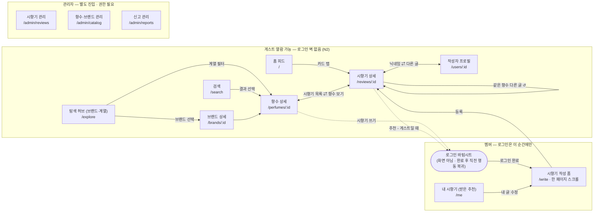

# 3단계: 사이트맵 / 정보구조 (IA)

> 프로젝트: **perfumeishuman — "향수가 사람이라면?"**
> 작성일: 2026-08-09 · 상태: **초안 (검토 중 — §5 결정 5개 확인 후 확정)**
> 근거 문서: [01-problem-definition-scope.md](./01-problem-definition-scope.md) · [02-user-stories.md](./02-user-stories.md)
> 시각화 버전: https://claude.ai/code/artifact/bf6ad483-1156-4d04-a3bc-3f0e5859067f

---

## 0. 구조 원칙

> **모든 길은 시향기 상세로 모인다.**

- 화면 13개, 하단 탭 4개(안). 어떤 경로로 들어와도 시향기 상세에 도착하고, 거기서 다음 글로 이어지는 읽기 루프가 돈다.
- 로그인은 **화면이 아니라 순간**이다 — 쓰기·추천을 시도하는 순간에만 바텀시트로 나타난다(N2). 열람 경로에는 로그인 벽이 없다.
- 접근 권한 3단계로 화면을 구획한다: **게스트 열람 가능 / 멤버 전용 / 관리자**(별도 진입).

## 1. 구조도

- 허브 2개: **향수 상세**(콘텐츠가 모이는 단위, M2)와 **시향기 상세**(콘텐츠 그 자체, M3).
- 점선 = 게스트가 로그인 게이트를 경유하는 전환 경로. 멤버는 게이트를 그대로 통과한다.
- 관리자 영역은 일반 내비게이션과 연결되지 않는다(별도 URL 직접 진입, 권한 플래그 검사 — E1).

## 2. 글로벌 내비게이션 (안 — Q1·Q4)

| 위치 | 구성 | 비고 |
|---|---|---|
| 하단 탭바 (모바일) | **홈 / 탐색 / 쓰기 / MY** | 쓰기를 중앙 강조 탭으로 — 서비스의 심장(N3) |
| 상단 공통 | 검색 아이콘 → 전체 화면 검색 오버레이 | 모든 화면에서 진입 가능(A1), URL `/search` 유지 |
| 로그인 | 탭·메뉴에 없음 | 쓰기·추천 시도 순간에만 바텀시트로 등장 |

## 3. 화면 목록 — 13개

### 게스트 열람 가능 (7 + 게이트 1)

| 화면 | 경로(안) | 핵심 내용 | 근거 |
|---|---|---|---|
| 홈 피드 | `/` | 시향기 카드 피드 — 추천순 기본·최신순 전환, 무한 스크롤. 100자 자유 서술 전문이 카드에 그대로 노출 | B1·M7 |
| 검색 | `/search` | 향수·브랜드 통합 검색. 빈 결과여도 인기 향수 노출 | A1·M1 |
| 탐색 허브 | `/explore` | 브랜드 가나다 목록 + 계열 칩 필터를 한 화면에 (→ Q2) | A2·A3 |
| 브랜드 상세 | `/brands/:id` | 그 브랜드의 향수 목록 (시향기 수·추천 수 표기) | A2 |
| 향수 상세 | `/perfumes/:id` | 기본 정보 + 시향기 목록(정렬) + "시향기 쓰기" 상시 버튼. 외부 구매 링크 자리 예약(MVP 비노출) | B2·N12 |
| 시향기 상세 | `/reviews/:id` | 전문 + 추천 버튼 + 같은 향수 다른 시향기 + 신고. 공유 URL로 로그인 없이 열림(SEO) | B3·C2·E3 |
| 작성자 프로필 | `/users/:id` | 닉네임 + 그 사람의 시향기 목록 + 총 추천 수 | D4 |
| 로그인 게이트 | (바텀시트) | 독립 페이지 없음 — 어느 화면에서든 오버레이. 소셜 1탭, 완료 후 직전 행동 복귀. 콜백 라우트(`/auth/callback`)만 존재 (→ Q3) | C1·M4 |

### 멤버 전용 (2)

| 화면 | 경로(안) | 핵심 내용 | 근거 |
|---|---|---|---|
| 시향기 작성·수정 | `/write` | 한 페이지 스크롤 폼: 자유 서술 100자(상단) + 태그 질문 4종(하단), 질문 카드 버튼, 자동 임시저장. 수정은 같은 폼에 기존 값 채움 | D1·D2·M5 |
| 내 시향기 (MY) | `/me` | 내 글 목록 + 글별·총 받은 추천 수, 닉네임 변경, 로그아웃 | D3·M8 |

### 관리자 (3 — 별도 진입 · 데스크톱 우선)

| 화면 | 경로(안) | 핵심 내용 | 근거 |
|---|---|---|---|
| 시향기 관리 | `/admin/reviews` | 전체 목록·검색(최신·작성자별), 수정·삭제(사유 메모 기록) | E1·M9 |
| 향수·브랜드 관리 | `/admin/catalog` | 브랜드·향수 등록/수정/삭제, 초기 시딩 도구. 시향기 달린 향수 삭제 시 경고 | E2·S4 |
| 신고 관리 | `/admin/reports` | 신고 목록·누적 수 확인, 처리(삭제/무시) | E3·S3 |

## 4. 핵심 흐름 4개

| # | 흐름 | 경로 | 의미 |
|---|---|---|---|
| F1 | **읽기 루프** | 홈 피드 → (카드 탭) → 시향기 상세 → {같은 향수 다른 글 · 향수 상세 · 작성자 프로필} → 다음 시향기 상세 ↺ | 체류의 엔진. "계속 구경하게 되는" 경험(1단계 §1.6)의 구조적 구현 — 시향기 상세에서 나가는 길 3개가 전부 다시 시향기로 돌아온다 |
| F2 | **탐색 → 선택** | 검색·브랜드·계열 → 향수 상세 → 시향기 읽기 → (외부 구매 링크 자리, MVP 비노출) | 입문자의 길 (N12 수익화 여지) |
| F3 | **쓰기 전환** | 향수 상세 [시향기 쓰기] → (게스트면) 로그인 바텀시트 → 작성 폼(임시저장 복원) → 등록 → 시향기 상세 + 피드 노출 | 서비스의 심장. 쓰기 탭 직접 진입 시 향수 선택부터 시작. 로그인 전 작성 내용 보존(N2·N3) |
| F4 | **추천 전환** | 시향기 상세 [추천] → (게스트면) 로그인 바텀시트 → 추천 자동 반영 → 같은 화면 복귀 | 추천이 로그인 전환 장치를 겸한다(1단계 §4.2 확정) |

## 5. 미확정 — 사용자 확인 필요 ⚠️

확정 전 결정 5개. 승인되면 이 문서의 상태를 "확정"으로 바꾸고 4단계(와이어프레임)로 진행한다.

1. **하단 탭 4개: 홈 · 탐색 · 쓰기 · MY** — 쓰기가 서비스의 심장(N3)이므로 중앙 강조 탭으로 상시 노출하는 안. 대안: 쓰기를 탭에서 빼고 향수 상세에서만 진입(탭 3개).
2. **탐색 허브 통합** — 브랜드 목록 + 계열 필터를 한 화면(`/explore`)에. 모바일 탭 수를 아끼고 "이름 모르는 입문자"와 "브랜드는 아는 사람"을 같은 입구로. 대안: `/brands`와 `/categories` 분리.
3. **로그인은 독립 페이지 없음** — 전 화면 바텀시트. 열람 경로에 로그인 벽 없음(N2)의 구조적 표현. 소셜 콜백용 라우트만 둔다.
4. **검색은 상단 공통 아이콘 → 전체 화면 오버레이** — URL은 `/search` 유지(검색 결과 공유·SEO 가능).
5. **URL 영문 복수형** (`/perfumes/:id` 등) — 표준 REST 관례. `:id`의 실제 형태(숫자 vs SEO 슬러그)는 6단계 ERD에서 확정.

## 6. 참고 — UI 색상 방향 메모 (8단계에서 구체화)

시각화 버전(아티팩트)에서 사용자 요청으로 **이브 클랭 블루(IKB, `#002FA5`)**를 메인 컬러로 사용했다. 클랭의 3색(IKB·Monopink·Monogold)을 접근 권한 인코딩(게스트/멤버/관리자)에 대응시킨 방향이 반응이 좋으면 8단계 UI 디자인에서 이어받는 것을 검토한다.
