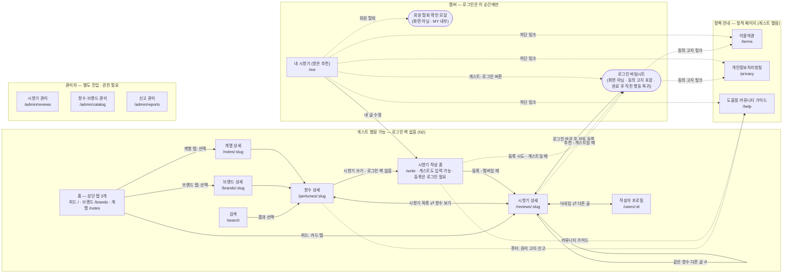

# 3단계: 사이트맵 / 정보구조 (IA)

> 프로젝트: **perfumeishuman — "향수가 사람이라면?"**
> 작성일: 2026-08-09 · 상태: **확정 (2026-08-11 — §5 결정 5개 사용자 승인)**
> 개정: 2026-08-16 — 법적 준수 화면 소급 반영 (화면 **13개 → 16개**, §5 결정 6·7 추가). 근거: [ADR 0008](./adr/0008-anonymized-retention-on-withdrawal.md) · [ADR 0009](./adr/0009-perfume-image-sourcing-and-takedown.md) · [02-user-stories.md](./02-user-stories.md) Epic F
> 근거 문서: [01-problem-definition-scope.md](./01-problem-definition-scope.md) · [02-user-stories.md](./02-user-stories.md)
> 시각화 버전: https://claude.ai/code/artifact/bf6ad483-1156-4d04-a3bc-3f0e5859067f

---

## 0. 구조 원칙

> **모든 길은 시향기 상세로 모인다.**

- 화면 16개(홈의 상단 탭 3개를 한 화면으로 셈), 하단 탭 3개(홈·쓰기·MY). 어떤 경로로 들어와도 시향기 상세에 도착하고, 거기서 다음 글로 이어지는 읽기 루프가 돈다.
- 로그인은 **화면이 아니라 순간**이다 — 쓰기 **등록(제출)**·추천을 시도하는 순간과 MY 탭의 로그인 버튼에서만 바텀시트로 나타난다(N2). 열람 경로에는 로그인 벽이 없고, **작성 폼(`/write`) 입력도 게스트에게 열려 있다** — 로그인은 등록 버튼을 누르는 순간에만 요구된다. **탈퇴도 같은 원칙으로 화면이 아니라 MY 안의 확인 모달이다**(F3).
- 정책 화면 3개(`/terms`·`/privacy`·`/help`)는 **읽기 루프 바깥의 정적 페이지**다. 내비게이션에 자리를 차지하지 않고, 필요한 순간(로그인 고지·MY 하단·향수 상세 푸터)에만 진입한다.
- 접근 권한 3단계로 화면을 구획한다: **게스트 열람 가능 / 멤버 전용 / 관리자**(별도 진입).

## 1. 구조도

- 허브 2개: **향수 상세**(콘텐츠가 모이는 단위, M2)와 **시향기 상세**(콘텐츠 그 자체, M3).
- 점선 = 게스트가 로그인 게이트를 경유하는 전환 경로, 그리고 정책·안내 페이지로 빠지는 경로. 멤버는 게이트를 그대로 통과한다.
- **`/write`는 게스트·멤버 접근 등급이 혼합된 유일한 화면**이다 — 진입·입력은 게스트도 가능(로그인 벽 없음)하지만, **등록(제출) 버튼을 누르는 순간에만** 게이트가 뜬다. 그 전까지 입력한 내용은 게이트를 거쳐도 보존되어 그대로 자동 등록된다(N2·N3).
- 정책 페이지는 **들어갔다가 원래 자리로 돌아오는 막다른 길**이다. 읽기 루프(FL1)에 개입하지 않으며, 로그인 흐름 중에 열어도 흐름이 끊기지 않아야 한다(스토리 F1 AC).
- 관리자 영역은 일반 내비게이션과 연결되지 않는다(별도 URL 직접 진입, 권한 플래그 검사 — E1).

## 2. 글로벌 내비게이션 (확정)

| 위치 | 구성 | 비고 |
|---|---|---|
| 하단 탭바 (모바일) | **홈 / 쓰기 / MY** | 쓰기를 중앙 강조 탭으로 — 서비스의 심장(N3). 탐색은 홈 상단 탭으로 흡수 |
| 홈 상단 탭 | **피드 / 브랜드 / 계열** | `/` · `/brands` · `/notes` — 탭마다 URL을 가져 공유·SEO 가능 |
| 상단 공통 | 검색 아이콘 → 전체 화면 검색 오버레이 | 모든 화면에서 진입 가능(A1), URL `/search` 유지 |
| 로그인 | 독립 페이지·탭 없음 | 쓰기 **등록(제출)**·추천 시도 순간 + MY 탭의 로그인 버튼 — 모두 바텀시트로 등장. 작성 폼 진입·입력 자체는 게스트도 가능 (D1). **약관·처리방침 동의 고지를 버튼 영역에 포함**(F1) |
| 정책·안내 | 내비게이션에 노출 없음 | `/terms` `/privacy` `/help` — 로그인 고지, MY 하단, 향수 상세 푸터에서만 진입 |
| 회원 탈퇴 | 독립 페이지 없음 | MY 하단 → **확인 모달**(F3). 로그인을 바텀시트로 처리한 것과 같은 원칙 |

## 3. 화면 목록 — 16개

### 게스트 열람 가능 (11 + 게이트 1)

| 화면 | 경로 | 핵심 내용 | 근거 |
|---|---|---|---|
| 홈 (상단 탭 3개) | `/` 피드 · `/brands` 브랜드 · `/notes` 계열 | **피드 탭**: 시향기 카드 피드 — 추천순 기본·최신순 전환, 무한 스크롤, 100자 자유 서술 전문이 카드에 그대로 노출. **브랜드 탭**: 브랜드 가나다 목록. **계열 탭**: 계열 목록 | B1·M7·A2·A3 |
| 검색 | `/search` | 향수·브랜드 통합 검색. 빈 결과여도 인기 향수 노출 | A1·M1 |
| 브랜드 상세 | `/brands/:slug` | 그 브랜드의 향수 목록 (시향기 수·추천 수 표기) | A2 |
| 계열 상세 | `/notes/:slug` | 그 계열의 향수 목록 (시향기 수·추천 수 표기). 브랜드 상세와 대칭 구조 — 도메인 엔티티명은 "계열", URL만 `notes` 사용 (사용자 확정) | A3 |
| 향수 상세 | `/perfumes/:slug` | 기본 정보 + 시향기 목록(정렬) + "시향기 쓰기" 상시 버튼. 외부 구매 링크 자리 예약(MVP 비노출). **이미지 없으면 텍스트 카드 폴백 + 푸터에 상표 권리 고지·신고 창구** | B2·N12·N13 |
| 시향기 상세 | `/reviews/:slug` | 전문 + 추천 버튼 + 같은 향수 다른 시향기 + 신고. 공유 URL로 로그인 없이 열림(SEO) | B3·C2·E3 |
| 작성자 프로필 | `/users/:id` | 닉네임 + 그 사람의 시향기 목록 + 총 추천 수. **탈퇴 회원(`user_NNNNNN`)은 진입 불가 — 닉네임이 링크로 동작하지 않음** | D4·F3 |
| 시향기 작성 폼 | `/write` | 한 페이지 스크롤 폼: 자유 서술 100자(상단) + 태그 질문 2종(하단), 질문 카드 버튼, 자동 임시저장. **게스트도 진입·입력 가능 — 로그인은 등록(제출) 순간에만 요구**되며, 그 전 입력은 게이트를 거쳐도 보존된다. 수정 모드(본인 글만, 항상 로그인 상태)는 같은 폼에 기존 값 채움 | D1·D2·M5 |
| 이용약관 | `/terms` | 정적 페이지. 제7~10조(콘텐츠 이용허락·탈퇴 후 처리·이미지 권리·침해 신고) 확정, 나머지 8단계 | F2·M11 |
| 개인정보처리방침 | `/privacy` | 정적 페이지. 수집 항목·보관기간·탈퇴 시 처리 — 5·6단계 확정 내용을 8단계에 반영 | F2·M11 |
| 도움말·커뮤니티 가이드 | `/help` | 사용법 + 커뮤니티 가이드(작성 화면 1줄 요약의 연결처) + **권리 침해 신고 창구·절차 요약** | F4·N9·N13 |
| 로그인 게이트 | (바텀시트) | 독립 페이지 없음 — 어느 화면에서든 오버레이. 소셜 1탭, 완료 후 직전 행동 복귀. 진입: 쓰기 **등록**·추천 시도 + MY 탭 로그인 버튼. 콜백 라우트(`/auth/callback`)만 존재. **약관·처리방침 동의 고지 포함** | C1·M4·F1 |

### 멤버 전용 (1)

| 화면 | 경로 | 핵심 내용 | 근거 |
|---|---|---|---|
| 내 시향기 (MY) | `/me` | 내 글 목록 + 글별·총 받은 추천 수, 닉네임 변경, 로그아웃. 게스트가 MY 탭 진입 시 로그인 버튼 노출 → 바텀시트. **하단에 약관·처리방침·도움말 링크와 회원 탈퇴 진입(확인 모달)** | D3·M8·F2·F3 |

### 관리자 (3 — 별도 진입 · 데스크톱 우선)

| 화면 | 경로 | 핵심 내용 | 근거 |
|---|---|---|---|
| 시향기 관리 | `/admin/reviews` | 전체 목록·검색(최신·작성자별), 수정·삭제(사유 메모 기록) | E1·M9 |
| 향수·브랜드 관리 | `/admin/catalog` | 브랜드·향수 등록/수정/삭제, 초기 시딩 도구. 시향기 달린 향수 삭제 시 경고. **이미지 원본 출처 URL 필수 입력, 재수집 금지 목록 경고, 브랜드 단위 이미지 일괄 비공개** | E2·S4·N13 |
| 신고 관리 | `/admin/reports` | 신고 목록·누적 수 확인, 처리(삭제/무시) | E3·S3 |

## 4. 핵심 흐름 4개

> **ID 변경 (2026-08-16)**: 흐름 ID를 `F1~F4` → **`FL1~FL4`**로 바꿨다. 2단계에 Epic F(계정과 고지) 스토리 F1~F4가 신설되면서 ID가 충돌했기 때문이다. 앞으로 `F*`는 스토리, `FL*`은 흐름을 가리킨다.

| # | 흐름 | 경로 | 의미 |
|---|---|---|---|
| FL1 | **읽기 루프** | 홈(피드 탭) → (카드 탭) → 시향기 상세 → {같은 향수 다른 글 · 향수 상세 · 작성자 프로필} → 다음 시향기 상세 ↺ | 체류의 엔진. "계속 구경하게 되는" 경험(1단계 §1.6)의 구조적 구현 — 시향기 상세에서 나가는 길 3개가 전부 다시 시향기로 돌아온다 |
| FL2 | **탐색 → 선택** | 검색 또는 홈의 브랜드·계열 탭 → 브랜드·계열 상세 → 향수 상세 → 시향기 읽기 → (외부 구매 링크 자리, MVP 비노출) | 입문자의 길 (N12 수익화 여지) |
| FL3 | **쓰기 전환** | 향수 상세 [시향기 쓰기] → 작성 폼(게스트도 입력 가능, 임시저장 복원) → [등록] → (게스트면) 로그인 바텀시트 → 자동 등록 → 시향기 상세 + 피드 노출 | 서비스의 심장. 쓰기 탭 직접 진입 시 향수 선택부터 시작. 로그인은 등록 시점에만 요구되며 그 전 입력은 그대로 보존된다(N2·N3) |
| FL4 | **추천 전환** | 시향기 상세 [추천] → (게스트면) 로그인 바텀시트 → 추천 자동 반영 → 같은 화면 복귀 | 추천이 로그인 전환 장치를 겸한다(1단계 §4.2 확정) |

## 5. 확정된 결정 5개 (2026-08-11 사용자 승인) ✅

1. **하단 탭 3개: 홈 · 쓰기 · MY** — 쓰기는 중앙 강조 탭(서비스의 심장, N3). 탐색은 별도 탭 대신 홈 상단 탭으로 흡수.
2. **홈과 탐색 허브 통합** — `/explore` 화면 제거. 홈 상단에 탭 3개(피드 `/` · 브랜드 `/brands` · 계열 `/notes`)를 두고, 브랜드·계열 탭에서 각 상세(`/brands/:slug` · `/notes/:slug`)로 이동. 계열 상세는 브랜드 상세와 대칭 구조.
3. **로그인은 독립 페이지 없음** — 전 화면 바텀시트. 쓰기 **등록(제출)**·추천 시도 순간뿐 아니라 MY 탭의 로그인 버튼에서도 동일하게 바텀시트로 진행. 소셜 콜백용 라우트(`/auth/callback`)만 둔다.
4. **검색은 상단 공통 아이콘 → 전체 화면 오버레이** — URL은 `/search` 유지(검색 결과 공유·SEO 가능).
5. **URL은 영문 복수형 + SEO 슬러그** — 향수·브랜드·계열·시향기의 `:slug`는 SEO 슬러그 사용 ([ADR 0005](./adr/0005-seo-slug-urls.md)). 슬러그 생성 규칙·중복 처리는 6단계 ERD에서 구체화. 작성자 프로필(`/users/:id`)의 식별자 형식도 6단계에서 확정.

### 추가 결정 2개 (2026-08-16 사용자 승인) ✅

6. **정책 화면 3개는 내비게이션 밖의 정적 페이지** — `/terms` · `/privacy` · `/help`를 추가하되 탭·메뉴에 노출하지 않는다. 진입은 로그인 바텀시트의 동의 고지, MY 하단, 향수 상세 푸터, 작성 폼의 커뮤니티 가이드 링크뿐이다. 읽기 루프(FL1)를 방해하지 않으면서 법적 접근성(M11·N13)을 확보한다.
7. **회원 탈퇴는 독립 화면 없이 MY 안의 확인 모달** — 로그인을 바텀시트로 처리한 결정 3과 같은 원칙. 화면 수를 늘리지 않으면서, 모달 안에서 "되돌릴 수 없음 · 글은 익명으로 남음 · 지우려면 탈퇴 전에 직접 삭제"를 고지한다 ([ADR 0008](./adr/0008-anonymized-retention-on-withdrawal.md), F3).

## 6. 참고 — UI 색상 방향 메모 (8단계에서 구체화)

시각화 버전(아티팩트)에서 사용자 요청으로 **이브 클랭 블루(IKB, `#002FA5`)**를 메인 컬러로 사용했다. 클랭의 3색(IKB·Monopink·Monogold)을 접근 권한 인코딩(게스트/멤버/관리자)에 대응시킨 방향이 반응이 좋으면 8단계 UI 디자인에서 이어받는 것을 검토한다.
