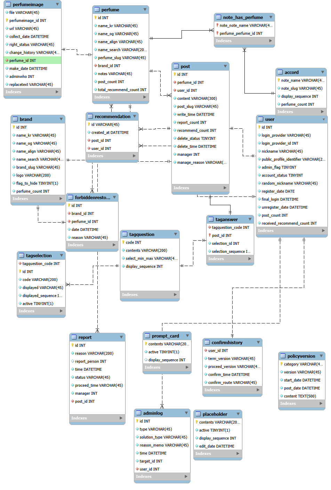

# 6단계: ERD (스키마 설계)

> 프로젝트: **perfumeishuman — "향수가 사람이라면?"**
> 작성일: 2026-09-27 · 상태: **확정**
> 근거 문서: [05-data-model.md](./05-data-model.md)
> 관련 ADR: [0003](./adr/0003-controlled-vocabulary-tags.md) · [0007](./adr/0007-reduce-tag-questions-to-two.md) · [0008](./adr/0008-anonymized-retention-on-withdrawal.md) · [0009](./adr/0009-perfume-image-sourcing-and-takedown.md) · [0010](./adr/0010-minimal-personal-data-collection.md) · [0011](./adr/0011-soft-delete-reviews.md) · [0012](./adr/0012-identifier-formats.md) · [0013](./adr/0013-age-tag-multi-select.md)

## 0. 읽는 법

ERD 본체는 다이어그램 자체(`erd6.png`)다. 이 문서는 두 가지 역할만 한다.

1. 5단계(`05-data-model.md` §3.7)의 엔티티 후보 18개(E1~E18)가 다이어그램에 빠짐없이 반영됐는지 대조한다.
2. 5단계 §7 "6단계로 넘기는 것"이 남겨둔 미결 사항을 이번 단계에서 어떻게 확정했는지 기록한다.

작업 과정에서 나온 중간 산출물(`erd.pdf` ~ `erd5.png`)은 삭제하지 않고 이력으로 남겨둔다. **최종본은 `erd6.png`다.**

## 1. 다이어그램

## 2. 엔티티 반영 확인표 (E1~E18 ↔ 테이블)

| # | 엔티티 | 테이블 | 비고 |
|---|---|---|---|
| E1 | 브랜드 | `brand` | 검색용 별칭(`name_search`), 향수 수 집계(`perfume_count`) 포함 |
| E2 | 향수 | `perfume` | 검색용 별칭(`name_search`), 시향기 수·총 추천 수 집계(`post_count`, `total_recommend_count`) 포함 |
| E3 | 향수 이미지 | `perfumeimage` | 가공일(`make_date`), 등록 관리자(`adminwho`→`user.id`), 대체 텍스트(`replacetext`) 포함 |
| E4 | 계열 | `accord` | 향수 수 집계(`perfume_count`) 포함 |
| E5 | 향수–계열 연결 | `note_has_perfume` | 다대다 연결 테이블 |
| E6 | 사용자 | `user` | 탈퇴 시각(`unregister_date`), 시향기 수·받은 추천 총합 집계(`post_count`, `received_recommend_count`) 포함 |
| E7 | 동의 이력 | `confirmhistory` | — |
| E8 | 정책 문서 버전 | `policyversion` | 본문(`content`) TEXT, 시행일·게시일 DATETIME |
| E9 | 시향기 | `post` | 추천 수·신고 수 집계(`recommend_count`, `report_count`), 소프트 삭제 처리 이력(`manager`→`user.id`, `manage_reason`, `delete_time`) 포함 |
| E10 | 시향기 태그 답변 | `taganswer` | 선택 순서(`selection_sequence`) 포함 — 대표 태그 판정(ADR 0013)의 근거 필드 |
| E11 | 태그 질문 | `tagquestion` | — |
| E12 | 태그 선택지 | `tagselection` | 질문 참조(`tagquestion_code`)와 선택지 값(`code`) 이름 분리 확인 |
| E13 | 추천 | `recommendation` | — |
| E14 | 신고 | `report` | 신고자(`report_person`)·처리자(`manager`) 모두 `user.id` 참조로 통일 |
| E15 | 관리자 조치 로그 | `adminlog` | `type`(대상 종류) + `target_id`(범용 참조) + `user_id`(관리자 참조) 조합으로 시향기·향수 등 여러 대상을 한 테이블에 기록 |
| E16 | 질문 카드 문구 | `prompt_card` | 노출 순서(`display_sequence`) 포함 |
| E17 | 작성 예시 placeholder | `placeholder` | 노출 순서(`display_sequence`) 포함 |
| E18 | 재수집 금지 목록 | `forbiddenrestore` | 브랜드·향수 참조, 등재일, 사유 모두 포함 |

18개 엔티티 후보가 전부 테이블로 존재하고, 5단계에서 요구한 핵심 필드가 누락 없이 반영된 것을 확인했다.

## 3. 이번 단계에서 새로 확정한 것

5단계 §7 "6단계로 넘기는 것" 중, 이번 ERD 작업에서 실제로 결정된 항목만 정리한다.

| 결정 | 내용 |
|---|---|
| **집계 컬럼 6종의 위치·이름** | `perfume.post_count`, `perfume.total_recommend_count`, `brand.perfume_count`, `accord.perfume_count`, `user.post_count`, `user.received_recommend_count`. (`post.recommend_count`·`post.report_count`는 5단계 §3.7 E9에서 이미 지정) |
| **관리자 조치 로그(E15)의 대상 표현 방식** | 대상마다 별도 FK 컬럼을 두지 않고, `type`(대상 종류) + `target_id`(대상 id, 폴리모픽 참조) 조합으로 시향기·향수 등 여러 종류의 조치를 한 테이블에 기록한다. DB 레벨 FK 제약으로는 강제되지 않으므로, "target_id가 가리키는 레코드가 type에 맞는 테이블에 실제로 존재하는지"는 애플리케이션이 보장한다. |
| **관리자 식별 필드 통일** | `post.manager`, `report.manager`, `report.report_person`, `perfumeimage.adminwho`, `adminlog.user_id` 전부 `user.id`를 가리키는 FK(INT)로 통일한다. 별도 admin 테이블은 두지 않는다 — 관리자는 `user.admin_flag=1`인 사용자일 뿐이며, 이 구분은 애플리케이션 레벨에서 보장한다. |
| **소프트 삭제 처리 이력의 스키마 반영 확인** | ADR 0011이 요구한 "삭제 상태·삭제 시각·처리 주체·사유"가 `post.delete_status`, `post.delete_time`, `post.manager`, `post.manage_reason`으로 반영됐다. |
| **`taganswer`에 선택 순서 필드 확정** | `selection_sequence`. 대표 태그는 화면 표시 순서가 아니라 "사용자가 실제로 고른 순서"로 판정하므로(ADR 0013), 답변 건마다 이 값을 저장한다. |
| **날짜형 필드 타입 정리** | `perfumeimage.collect_date`, `policyversion.start_date`, `policyversion.post_date`를 VARCHAR에서 DATETIME으로 정정했다. |

## 4. 여전히 다음 단계로 남는 것

5단계 §7 항목 중 이번 ERD에서 다루지 않고 그대로 넘기는 것도 명시해둔다.

| 항목 | 넘기는 이유 |
|---|---|
| 집계 컬럼의 **갱신 방식**(트리거 / 애플리케이션 갱신 / 주기 재계산) | 컬럼의 위치·이름만 이번에 정했고, 갱신 로직은 API 설계·구현과 함께 정하는 게 자연스럽다 → 7단계 |
| 소프트 삭제 조회 제외 방식(뷰 / 기본 스코프) | 쿼리 구현 전략이라 API 명세·구현 단계 소관 → 7·10단계 |
| 보관기간 경과분 완전 삭제 배치 | ADR 0011 §3, 10단계 환경 세팅에서 구현 |
| 약관 개정 공지 방식 "서비스 내 게시" 명시 | 8단계 약관 작성 시 반영 |
| 처리위탁 목록(호스팅·DB·소셜 공급자) | 9단계 기술 스택 확정 후 8단계 처리방침에 반영 |
| 인프라 접속 로그 보존기간 | 9·10단계 |

계열 통제 어휘 최종 세트(ADR 0015)와 슬러그·닉네임·프로필 식별자 생성 규칙(ADR 0012)은 이미 별도 ADR로 확정되어 있고, 이번 ERD가 그 결정을 그대로 반영했다(별도 재확인 불필요).

## 5. 다음 단계

**7단계: API 명세 (OpenAPI)**. 이 문서의 §4에 남은 미결 사항(집계 갱신 방식, 소프트 삭제 조회 제외 방식) 중 API 설계에 영향을 주는 부분은 7단계에서 함께 정한다.
